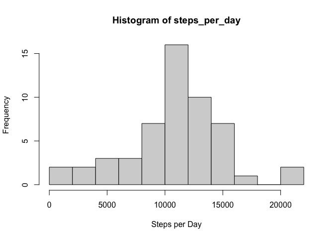
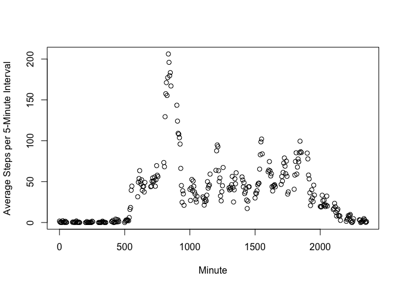
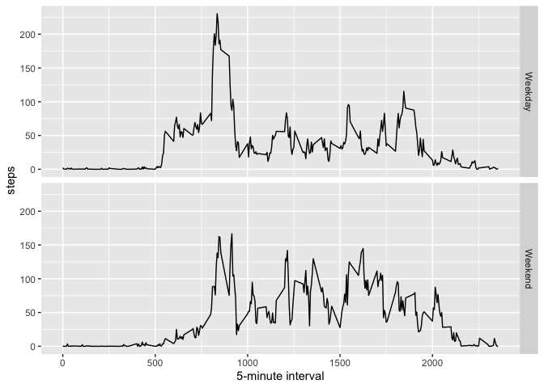

## Loading and preprocessing the data
First, unzip the data file, and read it into the environment into a variable called "data".


```r
unzip("activity.zip")
data <- read.csv("activity.csv")
```

## What is mean total number of steps taken per day?
Sum the number of steps each day using tapply with an index of date. Plot a histogram of the steps per day, and then calculate the mean and median when removing NA's. It's okay to have the NA's for the vector plotted in the histogram, because no values were measured on those days.


```r
steps_per_day <- tapply(data$steps,
                        data$date,sum,
                        na.rm = FALSE)
hist(steps_per_day,breaks = 10, xlab = "Steps per Day")
```

<!-- -->

```r
mean_steps <- mean(steps_per_day,na.rm = TRUE)
print(paste("Mean steps per day:",mean_steps))
```

```
## [1] "Mean steps per day: 10766.1886792453"
```

```r
median_steps <- median(steps_per_day,na.rm = TRUE)
print(paste("Median steps per day:",median_steps))
```

```
## [1] "Median steps per day: 10765"
```


## What is the average daily activity pattern?
The average for each 5-minute interval is calculated using the tapply function with an index of interval, and NA's removed. This is plotted with interval on the X-axis, and average steps on the Y-axis. The interval for the max steps value is found using which.max().

```r
mean_per_interval <- tapply(data$steps,data$interval,mean,na.rm = TRUE)
interval_vector <- unique(data$interval)
plot(interval_vector,
     mean_per_interval,
     xlab = "Minute",
     ylab = "Average Steps per 5-Minute Interval")
```

<!-- -->

```r
print(paste("5-minute interval with highest average steps:", interval_vector[which.max(mean_per_interval)],"minute"))
```

```
## [1] "5-minute interval with highest average steps: 835 minute"
```
## Imputing missing values
First, print to the console the total number of NA's. Then, impute values for the missing numbers using the average of that 5-minute interval (from the previous code chunk).

```r
#logical vector of NA rows:
na_rows <- is.na(data$steps)
print(paste("Number of Rows with NA's:",sum(na_rows)))
```

```
## [1] "Number of Rows with NA's: 2304"
```

```r
#create dataframe with only na data, loop through and assign mean value by interval. This could be done in one line, but is easier to read in a for loop
na_data <- data[na_rows,]
for (i in 1:length(na_data$steps)){
  na_data$steps[i]<-mean_per_interval[interval_vector == na_data$interval[i]]
}

# create identical dataframe as "data" with NAs replaced by m5-minute interval means
data2 <- data
data2$steps[na_rows] <- na_data$steps

# re-calculate steps_per_day, mean, and median values
steps_per_day <- tapply(data2$steps,data2$date,sum)
hist(steps_per_day,breaks = 10, xlab = "Steps per Day")
```

<!-- -->

```r
mean_steps <- mean(steps_per_day)
print(paste("Mean steps per day:",mean_steps))
```

```
## [1] "Mean steps per day: 10766.1886792453"
```

```r
median_steps <- median(steps_per_day)
print(paste("Median steps per day:",median_steps))
```

```
## [1] "Median steps per day: 10766.1886792453"
```
## Are there differences in activity patterns between weekdays and weekends?
First, use weekdays function to create a vector of day of week by row. Use %in% logical to separate weekdays and weekends, then create a new column in the data2 dataframe called weekend, which is a factor of either weekday of weekend. Then, use qplot to plot the average steps per time interval and weekend/weekday

```r
day_of_week <- weekdays(as.Date(data2$date,format = "%Y-%m-%d"))
weekdays_vector <- rep("",length(data2$date))
weekdays_logical <- day_of_week %in% c("Monday","Tuesday","Wednesday","Thursday","Friday")
weekdays_vector[weekdays_logical] <- "Weekday"
weekdays_vector[!weekdays_logical] <- "Weekend"
data2$weekend <- as.factor(weekdays_vector)

library(ggplot2)
qplot(interval,
      steps,
      data = aggregate(steps ~ interval + weekend,data = data2,mean),
      facets = weekend~.,
      geom = "line",
      xlab = "5-minute interval")
```

<!-- -->


